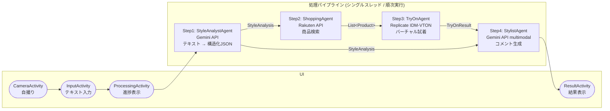

# VirtualFit AI

「着たい服」をテキストで入力して自撮りするだけで、商品検索・バーチャル試着・コーディネートアドバイスを自動でこなす Android アプリです。

処理を4つの専門クラスに役割分担した**シーケンシャルパイプライン設計**を採用しており、各ステップが独立しているため、使用する API やモデルの差し替えが容易な構成になっています。

---

## アプリ概要

| 項目 | 内容 |
|------|------|
| アプリ名 | VirtualFit AI |
| 対象端末 | Nexus 7 (API 23 / Android 6.0+) |
| 言語 | Java |
| 主要技術 | Camera2 API / Gemini API / Rakuten API / Replicate IDM-VTON / OkHttp / Gson / Glide |

---

## 機能概要

「白いリネンシャツが欲しい」とテキストを入力して撮影ボタンを押すだけで、楽天市場から候補商品を自動取得し、自分の写真にその服を合成したバーチャル試着画像とコーディネートコメントが返ってきます。

生成された試着画像に対して、そのままチャットで「もう少しカジュアルに」「色を変えて」などと追加リクエストを送ると、Gemini が画像を再生成して即座に反映されます。

試着→修正→購入を1アプリで完結させることをゴールとして、以下の処理を自動化しています。

| ステップ | 処理内容 |
|---------|---------|
| 1. 撮影 | Camera2 API でその場で自撮り |
| 2. テキスト入力 | 欲しい服をテキストで自由記述 |
| 3. 商品検索 | 入力を解析して楽天市場 API で商品を自動検索 |
| 4. バーチャル試着 | Replicate IDM-VTON で自分の写真に服を合成 |
| 5. コメント生成 | 試着画像をもとにコーディネートアドバイスを生成 |
| 6. チャットで修正 | 試着結果に追加リクエストを送ると Gemini が画像を再生成 |
| 7. 購入へ | 気に入った商品はそのまま購入ページへ遷移 |

---

## セットアップ

### 前提条件

- Android Studio（最新版推奨）
- JDK 11 以上
- Android SDK（API 23+）
- 各種 API キー（下記参照）

### API キーの設定

プロジェクトルートの `local.properties`（**Git には含めない**）に以下を追記してください。

```properties
gemini_api_key=YOUR_GEMINI_API_KEY
rakuten_app_id=YOUR_RAKUTEN_APP_ID
rakuten_access_key=YOUR_RAKUTEN_ACCESS_KEY
```

### ビルドと実行

1. このリポジトリをクローンする
2. Android Studio でプロジェクトを開く
3. `local.properties` に API キーを設定する
4. 実機またはエミュレータ（API 23+）で実行する

---

## パイプライン設計

処理は `AgentPipeline` が1スレッド上で以下の4ステップを順番に実行します。各ステップは独立したクラスとして実装されており、前ステップの出力を受け取って次ステップへ渡す構造です。

| ステップ | クラス | 使用 API | 担当タスク |
|---------|--------|---------|-----------|
| 1 | StyleAnalystAgent | Gemini 1.5 Flash | テキスト入力を構造化データ（JSON）に変換 |
| 2 | ShoppingAgent | Rakuten Ichiba API | 商品検索・購入 URL リスト取得 |
| 3 | TryOnAgent | Replicate IDM-VTON | 自撮り画像への服の合成（バーチャル試着） |
| 4 | StylistAgent | Gemini 1.5 Flash (multimodal) | 試着画像をもとにスタイリングコメントを生成 |

各クラスの差し替えは `AgentPipeline` を編集するだけで対応でき、たとえば別の試着モデルや別のショッピング API への変更も容易です。

---

## アーキテクチャ



```
com.example.cameramaltiagent/
├── ui/
│   ├── CameraActivity.java          # Camera2 プレビュー・撮影
│   ├── InputActivity.java           # テキスト入力・パイプライン起動
│   ├── ProcessingActivity.java      # 進捗表示
│   └── ResultActivity.java          # 結果表示
├── agent/
│   ├── AgentPipeline.java           # 4 エージェントの順次実行
│   ├── StyleAnalystAgent.java       # テキスト構造化
│   ├── ShoppingAgent.java           # 商品検索
│   ├── TryOnAgent.java              # IDM-VTON 実行
│   └── StylistAgent.java            # スタイリングコメント生成
├── api/
│   ├── GeminiApiClient.java         # Gemini API HTTP 通信
│   ├── ReplicateApiClient.java      # Replicate API HTTP 通信
│   └── ShoppingApiClient.java       # Rakuten API 通信
├── model/
│   ├── StyleAnalysis.java           # エージェント間データ
│   ├── Product.java                 # 商品データ
│   ├── TryOnResult.java             # 試着結果データ
│   └── AgentResult.java             # パイプライン最終結果
├── camera/
│   └── Camera2Helper.java           # Camera2 API 抽象化
└── util/
    ├── ImageUtil.java               # 画像処理ユーティリティ
    └── ApiKeyManager.java           # API キー管理（BuildConfig 経由）
```

---

## 実装のポイント

1. **パイプライン設計**
   - `AgentPipeline` が `ExecutorService` 上で 4 つの処理を順次実行する
   - 各ステップの出力が次ステップの入力になるデータパイプライン構造

2. **非同期ポーリングとタイムアウト制御（IDM-VTON）**
   - Replicate の推論が非同期のため、5 秒間隔・最大 24 回のポーリングを実装
   - 失敗時は別商品 URL で自動リトライ

3. **マルチモーダルリクエスト**
   - StylistAgent で画像 URL とテキストを組み合わせて Gemini に送信
   - 試着後の画像を元にコメントを生成

4. **JSON 出力の安定化**
   - JSON 形式のみを返すようプロンプトを設計
   - 正規表現による JSON ブロック抽出のフォールバック処理を実装

5. **Camera2 API のリソース管理**
   - `onPause()` での `closeCamera()` 実装によりメモリリークを防止
   - Nexus 7 向けに `inSampleSize` による画像縮小処理を適用

---


## ライセンス

このプロジェクトは個人・学習目的で作成されています。
